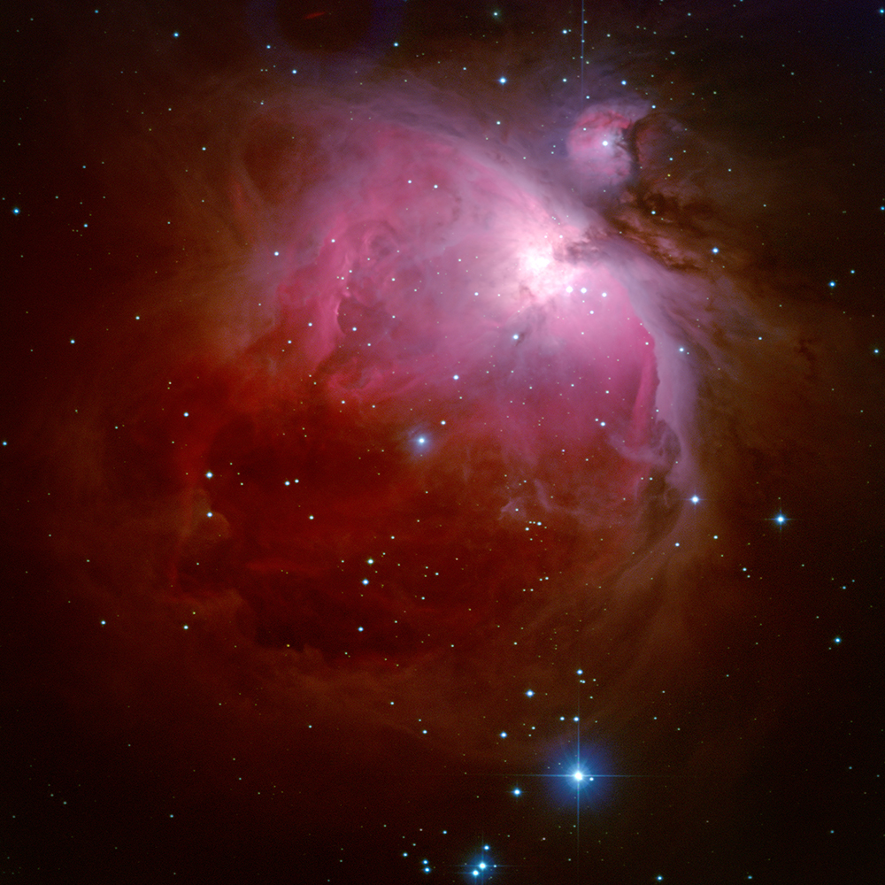

# Telesto reduction pipeline

Reduction pipeline for Telesto, the 60 cm telescope of the Geneva Observatory &amp; EPFL.

### Language
Python 3, package `pytelesto`.

### Features (WIP)
- Automatic image reduction
- Color images production
- Illumination correction
- Mosaic image assembly
- Photometric accuracy
- Depth of field
- HR Diagram
- Exoplanetary transit
- ...

**Orion nebula (M42) through the eye of Telesto**, by Guillaume Desprez.

